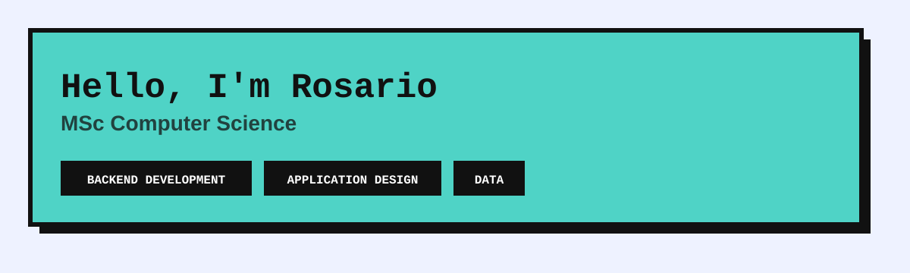

  MSc Computer Science

  Backend Development &nbsp;·&nbsp; Application Design &nbsp;·&nbsp; Data

---

<table align="center" width="600">
  <tr>
    <td valign="top" width="300">
      <b>MSC COMPUTER SCIENCE</b> 
      University of Bologna &nbsp;<i>ongoing</i>
    </td>
    <td valign="top" width="300">
      <b>BSC COMPUTER SCIENCE</b> 
      University of Padua &nbsp;<i>completed</i>
    </td>
  </tr>
</table>

---

## Tech Stack

### Programming Languages

---

### Backend & APIs

---

### Data Engineering & Machine Learning

---

### Tools & Testing

